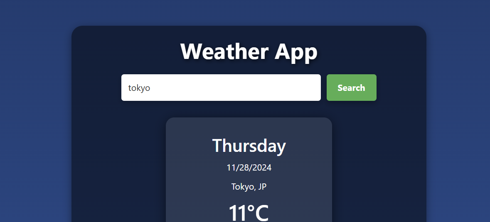
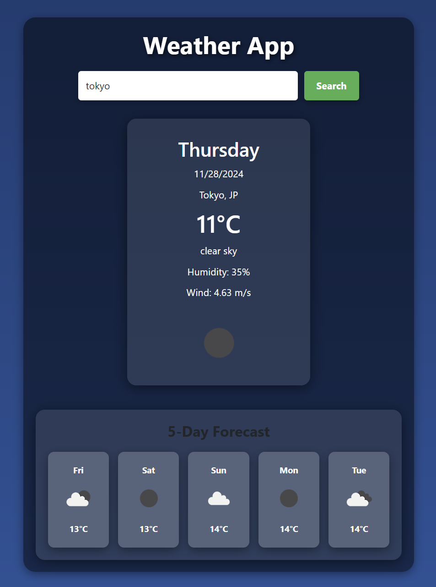
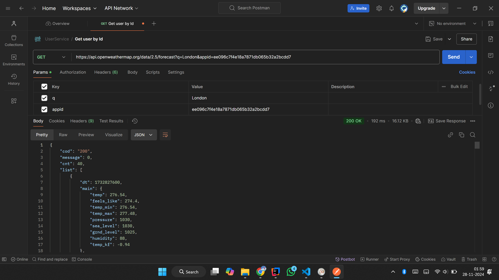

# Weather App 🌦️

A modern weather application built with React, powered by the OpenWeatherMap API. This app provides the current weather, detailed information, and a 5-day forecast for any city worldwide.

---

## Features
- 🌍 **City Search**: Users can search weather information for any city worldwide.
- 📆 **Current Weather**: Displays temperature, weather description, humidity, and wind speed.
- 🔮 **5-Day Forecast**: Shows one forecast per day with temperature and icons.
- 📱 **Responsive Design**: Optimized for both desktop and mobile devices.
- 🎨 **Modern UI**: Gradient backgrounds, semi-transparent cards, and shadow effects.

---

## Screenshots

### 1. Home Page with Search Bar  

### 2. Current Weather and 5-Day Forecast  

### 3. Postman Request  

